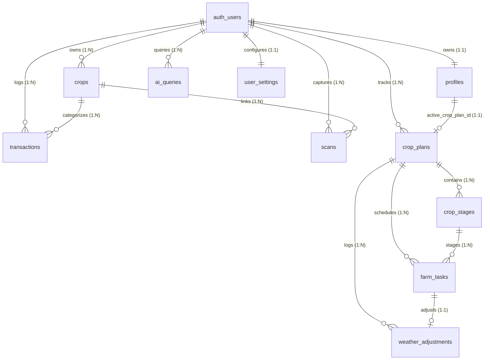

# AgroGPT Database Architecture Audit Report

**Audit Date:** May 30, 2026  
**Auditor:** Antigravity AI Codebase Architect  
**Status:** Audit Phase 1 Complete (Analysis & Documentation)

---

## Table of Contents
1. [Database Overview](#1-database-overview)
2. [All Dexie Tables (IndexedDB)](#2-all-dexie-tables-indexeddb)
3. [All Supabase Tables (Cloud PostgreSQL)](#3-all-supabase-tables-cloud-postgresql)
4. [Entity Relationship Map](#4-entity-relationship-map)
5. [Sync Engine Analysis](#5-sync-engine-analysis)
6. [Repository Usage Map](#6-repository-usage-map)
7. [Duplicated Data Analysis](#7-duplicated-data-analysis)
8. [Onboarding Impact Analysis](#8-onboarding-impact-analysis)
9. [Index Recommendations](#9-index-recommendations)
10. [Supabase Migration Readiness Report](#10-supabase-migration-readiness-report)

---

## 1. Database Overview

AgroGPT uses an offline-first, bidirectional data access design. The local web interface and business logic write immediately to a client-side IndexedDB database. A background synchronizer then pushes and pulls changes to a remote Supabase PostgreSQL database.

*   **Dexie.js Version:** 4.x (Active in `src/lib/db.ts`)
*   **Local Database Schema Version:** 4 (Contains 11 tables)
*   **Existing Supabase Migrations:**
    *   `0001_precision_planning.sql`: Initial legacy schema tables (`crop_cycles`, `daily_tasks`, `soil_reports`, `crop_requirements`).
    *   `0002_market_post_harvest.sql`: Storage and ledger tables (`storage_stock`, `financial_ledger`).
    *   `0003_crop_calendar_local_first.sql`: Modern crop calendar scheduling schema (`crop_plans`, `crop_stages`, `farm_tasks`, `weather_adjustments`).
    *   `0004_farmer_onboarding.sql`: Onboarding additions (alters `profiles` and `crop_plans`).
*   **Sync Architecture Summary:**
    *   The sync manager (`syncEngine.ts`) utilizes batch upserts via the Supabase client.
    *   Optimistic updates occur locally in Dexie with `sync_status = 'pending'`.
    *   Data updates are synchronized on network recovery or session login.
    *   Last-Write-Wins and Version-First tracking resolve cloud conflicts.

---

## 2. All Dexie Tables (IndexedDB)

The following tables are defined in `src/lib/db.ts` across schema versions 1 to 4:

### 1. `profiles`
*   **Purpose:** Stores farmer profiles, farm details, location labels, and NPK metrics.
*   **Primary Key:** `id` (String - Supabase Auth User UUID)
*   **Indexes:** `id`
*   **Relationships:**
    *   1-to-1 with Supabase `auth.users`
    *   1-to-1 lookup to `crop_plans` (via `active_crop_plan_id`)

### 2. `crops` (Legacy)
*   **Purpose:** Stores basic details of active and completed crops.
*   **Primary Key:** `id` (String - UUID)
*   **Indexes:** `id`, `user_id`, `status`, `planted_date`, `deleted_at`
*   **Relationships:**
    *   Many-to-1 with `profiles` (via `user_id`)
    *   1-to-Many with `transactions` (via `crop_id`)
    *   1-to-Many with `scans` (via `crop_id`)

### 3. `transactions`
*   **Purpose:** Tracks income and expense logs for the financial ledger (Digital Khata).
*   **Primary Key:** `id` (String - UUID)
*   **Indexes:** `id`, `user_id`, `crop_id`, `type`, `transaction_date`, `deleted_at`
*   **Relationships:**
    *   Many-to-1 with `profiles` (via `user_id`)
    *   Many-to-1 with `crops` (via `crop_id`, optional)

### 4. `scans`
*   **Purpose:** Stores diagnostic leaf scans and AI classification output.
*   **Primary Key:** `id` (String - UUID)
*   **Indexes:** `id`, `user_id`, `crop_id`, `scanned_at`, `deleted_at`
*   **Relationships:**
    *   Many-to-1 with `profiles` (via `user_id`)
    *   Many-to-1 with `crops` (via `crop_id`, optional)

### 5. `ai_queries`
*   **Purpose:** Queues offline conversations with the AI Assistant for backend sync.
*   **Primary Key:** `id` (String - UUID)
*   **Indexes:** `id`, `user_id`, `status`, `deleted_at`
*   **Relationships:**
    *   Many-to-1 with `profiles` (via `user_id`)

### 6. `user_settings`
*   **Purpose:** Stores user interface configurations and language preferences.
*   **Primary Key:** `id` (String - UUID)
*   **Indexes:** `id`, `user_id`
*   **Relationships:**
    *   1-to-1 with `profiles` (via `user_id`)

### 7. `crop_plans`
*   **Purpose:** Stores metadata for crop cultivation cycles.
*   **Primary Key:** `id` (String - UUID)
*   **Indexes:** `id`, `user_id`, `status`, `sowing_date`, `deleted_at`
*   **Relationships:**
    *   Many-to-1 with `profiles` (via `user_id`)
    *   1-to-Many with `crop_stages` (via `plan_id`)
    *   1-to-Many with `farm_tasks` (via `plan_id`)
    *   1-to-Many with `weather_adjustments` (via `plan_id`)

### 8. `crop_stages`
*   **Purpose:** Stores growth stages boundary dates for each plan.
*   **Primary Key:** `id` (String - UUID)
*   **Indexes:** `id`, `plan_id`, `status`, `start_date`, `end_date`, `deleted_at`
*   **Relationships:**
    *   Many-to-1 with `crop_plans` (via `plan_id`)
    *   1-to-Many with `farm_tasks` (via `stage_id`)

### 9. `farm_tasks`
*   **Purpose:** Stores scheduled operations and weather-adjusted execution dates.
*   **Primary Key:** `id` (String - UUID)
*   **Indexes:** `id`, `plan_id`, `stage_id`, `status`, `task_date`, `task_type`, `deleted_at`
*   **Relationships:**
    *   Many-to-1 with `crop_plans` (via `plan_id`)
    *   Many-to-1 with `crop_stages` (via `stage_id`, optional)
    *   1-to-Many/1-to-1 with `weather_adjustments` (via `task_id`)

### 10. `weather_adjustments`
*   **Purpose:** Logs historical details of rain delays or warning adjustments.
*   **Primary Key:** `id` (String - UUID)
*   **Indexes:** `id`, `plan_id`, `task_id`, `adjustment_type`, `deleted_at`
*   **Relationships:**
    *   Many-to-1 with `crop_plans` (via `plan_id`)
    *   Many-to-1 with `farm_tasks` (via `task_id`)

### 11. `dashboard_cache`
*   **Purpose:** Caches local snapshot aggregations and Gemini outputs (Local-only, unsynced).
*   **Primary Key:** `key` (String)
*   **Indexes:** `key`
*   **Relationships:** None

---

## 3. All Supabase Tables (Cloud PostgreSQL)

The remote tables are structured in PostgreSQL. Note that **base schemas** for `profiles`, `crops`, `transactions`, `scans`, `ai_queries`, and `user_settings` are managed directly on Supabase and are not checked into the current migration history (audited in Section 10).

### 1. `profiles` (Ghost Table - Reconstructed from Code & Migration 0004)
```sql
CREATE TABLE profiles (
  id UUID PRIMARY KEY REFERENCES auth.users(id) ON DELETE CASCADE,
  name TEXT,
  display_name TEXT,
  preferred_language TEXT,
  email TEXT,
  phone TEXT,
  city TEXT,
  soil_type TEXT,
  primary_crop TEXT,
  total_acreage NUMERIC,
  nitrogen NUMERIC,
  phosphorus NUMERIC,
  potassium NUMERIC,
  farm_name TEXT,
  farm_area_value NUMERIC,
  farm_area_unit TEXT,
  farm_area_acres NUMERIC,
  irrigation_sources TEXT[],
  state TEXT,
  district TEXT,
  village TEXT,
  latitude NUMERIC,
  longitude NUMERIC,
  location_label TEXT,
  onboarding_completed BOOLEAN DEFAULT FALSE,
  profile_completed_at TIMESTAMP WITH TIME ZONE,
  active_crop_plan_id UUID,
  sync_status TEXT DEFAULT 'synced',
  version INT DEFAULT 1,
  created_at TIMESTAMP WITH TIME ZONE DEFAULT NOW(),
  updated_at TIMESTAMP WITH TIME ZONE DEFAULT NOW()
);
```

### 2. `crops` (Ghost Table - Reconstructed from Code)
```sql
CREATE TABLE crops (
  id UUID PRIMARY KEY DEFAULT gen_random_uuid(),
  user_id UUID REFERENCES auth.users(id) ON DELETE CASCADE,
  name TEXT NOT NULL,
  variety TEXT NOT NULL,
  planted_date DATE NOT NULL,
  area NUMERIC NOT NULL,
  status TEXT NOT NULL DEFAULT 'active',
  created_at TIMESTAMP WITH TIME ZONE DEFAULT NOW(),
  updated_at TIMESTAMP WITH TIME ZONE DEFAULT NOW(),
  deleted_at TIMESTAMP WITH TIME ZONE
);
```

### 3. `transactions` (Ghost Table - Reconstructed from Code)
```sql
CREATE TABLE transactions (
  id UUID PRIMARY KEY DEFAULT gen_random_uuid(),
  user_id UUID REFERENCES auth.users(id) ON DELETE CASCADE,
  crop_id UUID REFERENCES crops(id) ON DELETE SET NULL,
  type TEXT NOT NULL,
  category TEXT NOT NULL,
  amount NUMERIC NOT NULL,
  note TEXT,
  transaction_date DATE DEFAULT CURRENT_DATE,
  created_at TIMESTAMP WITH TIME ZONE DEFAULT NOW(),
  updated_at TIMESTAMP WITH TIME ZONE DEFAULT NOW(),
  deleted_at TIMESTAMP WITH TIME ZONE
);
```

### 4. `scans` (Ghost Table - Reconstructed from Code)
```sql
CREATE TABLE scans (
  id UUID PRIMARY KEY DEFAULT gen_random_uuid(),
  user_id UUID REFERENCES auth.users(id) ON DELETE CASCADE,
  crop_id UUID REFERENCES crops(id) ON DELETE SET NULL,
  crop_type TEXT NOT NULL,
  image_url TEXT NOT NULL,
  prediction TEXT NOT NULL,
  confidence NUMERIC NOT NULL,
  is_low_confidence BOOLEAN DEFAULT FALSE,
  feedback TEXT,
  ai_enhanced BOOLEAN DEFAULT FALSE,
  scanned_at TIMESTAMP WITH TIME ZONE DEFAULT NOW(),
  created_at TIMESTAMP WITH TIME ZONE DEFAULT NOW(),
  updated_at TIMESTAMP WITH TIME ZONE DEFAULT NOW(),
  deleted_at TIMESTAMP WITH TIME ZONE
);
```

### 5. `ai_queries` (Ghost Table - Reconstructed from Code)
```sql
CREATE TABLE ai_queries (
  id UUID PRIMARY KEY DEFAULT gen_random_uuid(),
  user_id UUID REFERENCES auth.users(id) ON DELETE CASCADE,
  question TEXT NOT NULL,
  context JSONB,
  answer TEXT,
  status TEXT NOT NULL DEFAULT 'pending',
  created_at TIMESTAMP WITH TIME ZONE DEFAULT NOW(),
  updated_at TIMESTAMP WITH TIME ZONE DEFAULT NOW(),
  deleted_at TIMESTAMP WITH TIME ZONE
);
```

### 6. `user_settings` (Ghost Table - Reconstructed from Code)
```sql
CREATE TABLE user_settings (
  id UUID PRIMARY KEY DEFAULT gen_random_uuid(),
  user_id UUID REFERENCES auth.users(id) ON DELETE CASCADE,
  language TEXT NOT NULL DEFAULT 'en',
  font_size TEXT NOT NULL DEFAULT 'medium',
  notifications_enabled BOOLEAN DEFAULT FALSE,
  biometric_enabled BOOLEAN DEFAULT FALSE,
  last_sync TIMESTAMP WITH TIME ZONE DEFAULT NOW(),
  created_at TIMESTAMP WITH TIME ZONE DEFAULT NOW(),
  updated_at TIMESTAMP WITH TIME ZONE DEFAULT NOW()
);
```

### 7. `crop_plans` (Defined in `0003` & modified in `0004`)
```sql
CREATE TABLE crop_plans (
  id UUID PRIMARY KEY DEFAULT gen_random_uuid(),
  user_id UUID REFERENCES auth.users(id) ON DELETE CASCADE,
  crop_type TEXT NOT NULL,
  variety TEXT NOT NULL,
  sowing_date DATE NOT NULL,
  area NUMERIC NOT NULL,
  status TEXT NOT NULL DEFAULT 'active',
  version INT NOT NULL DEFAULT 1,
  sync_status TEXT NOT NULL DEFAULT 'synced',
  created_at TIMESTAMP WITH TIME ZONE DEFAULT NOW(),
  updated_at TIMESTAMP WITH TIME ZONE DEFAULT NOW(),
  deleted_at TIMESTAMP WITH TIME ZONE,
  -- Added in 0004:
  crop_area_value NUMERIC,
  crop_area_unit TEXT,
  crop_area_acres NUMERIC,
  farmer_selected_stage TEXT,
  crop_condition TEXT,
  created_by_onboarding BOOLEAN DEFAULT FALSE
);
```

### 8. `crop_stages` (Defined in `0003`)
```sql
CREATE TABLE crop_stages (
  id UUID PRIMARY KEY DEFAULT gen_random_uuid(),
  plan_id UUID REFERENCES crop_plans(id) ON DELETE CASCADE,
  name TEXT NOT NULL,
  start_day INT NOT NULL,
  end_day INT NOT NULL,
  start_date DATE NOT NULL,
  end_date DATE NOT NULL,
  status TEXT NOT NULL DEFAULT 'upcoming',
  version INT NOT NULL DEFAULT 1,
  sync_status TEXT NOT NULL DEFAULT 'synced',
  created_at TIMESTAMP WITH TIME ZONE DEFAULT NOW(),
  updated_at TIMESTAMP WITH TIME ZONE DEFAULT NOW(),
  deleted_at TIMESTAMP WITH TIME ZONE
);
```

### 9. `farm_tasks` (Defined in `0003`)
```sql
CREATE TABLE farm_tasks (
  id UUID PRIMARY KEY DEFAULT gen_random_uuid(),
  plan_id UUID REFERENCES crop_plans(id) ON DELETE CASCADE,
  stage_id UUID REFERENCES crop_stages(id) ON DELETE SET NULL,
  title TEXT NOT NULL,
  description TEXT,
  status TEXT NOT NULL DEFAULT 'pending',
  task_date DATE NOT NULL,
  scheduled_date DATE NOT NULL,
  effective_date DATE NOT NULL,
  task_type TEXT NOT NULL,
  priority TEXT NOT NULL DEFAULT 'medium',
  notes TEXT,
  origin TEXT NOT NULL DEFAULT 'template',
  task_template_id TEXT,
  is_recurring BOOLEAN NOT NULL DEFAULT FALSE,
  recurrence_interval_days INT,
  version INT NOT NULL DEFAULT 1,
  sync_status TEXT NOT NULL DEFAULT 'synced',
  created_at TIMESTAMP WITH TIME ZONE DEFAULT NOW(),
  updated_at TIMESTAMP WITH TIME ZONE DEFAULT NOW(),
  deleted_at TIMESTAMP WITH TIME ZONE
);
```

### 10. `weather_adjustments` (Defined in `0003`)
```sql
CREATE TABLE weather_adjustments (
  id UUID PRIMARY KEY DEFAULT gen_random_uuid(),
  plan_id UUID REFERENCES crop_plans(id) ON DELETE CASCADE,
  task_id UUID REFERENCES farm_tasks(id) ON DELETE CASCADE,
  adjustment_type TEXT NOT NULL,
  reason TEXT NOT NULL,
  original_date DATE NOT NULL,
  adjusted_date DATE NOT NULL,
  weather_data JSONB,
  applied_at TIMESTAMP WITH TIME ZONE DEFAULT NOW(),
  version INT NOT NULL DEFAULT 1,
  sync_status TEXT NOT NULL DEFAULT 'synced',
  created_at TIMESTAMP WITH TIME ZONE DEFAULT NOW(),
  updated_at TIMESTAMP WITH TIME ZONE DEFAULT NOW(),
  deleted_at TIMESTAMP WITH TIME ZONE
);
```

### Legacy Tables (Defined in `0001` and `0002` - Deprecated/Unsynced)
*   **`crop_cycles` / `daily_tasks` / `soil_reports` / `crop_requirements`** (Supabase migration `0001`). Unused in the local-first application layout.
*   **`storage_stock` / `financial_ledger`** (Supabase migration `0002`). Replaced by the local-first transactions table.

---

## 4. Entity Relationship Map

Below is the logical data relationship map linking entities inside the AgroGPT database schema.



---

## 5. Sync Engine Analysis

The file `src/core/api/syncEngine.ts` defines synchronization flows for 10 entities. 

| Table Name | Sync Direction | Conflict Resolution Strategy | Version Field | Timestamp Field | Sync Status Tracking |
| :--- | :--- | :--- | :--- | :--- | :--- |
| `profiles` | Bidirectional | Last-Write-Wins (Timestamp) | No | `updated_at` | `sync_status` |
| `crops` | Bidirectional | Last-Write-Wins (Timestamp) | No | `updated_at` | `sync_status` |
| `transactions` | Bidirectional | Last-Write-Wins (Timestamp) | No | `updated_at` | `sync_status` |
| `scans` | Bidirectional | Last-Write-Wins (Timestamp) | No | `updated_at` | `sync_status` |
| `ai_queries` | Bidirectional | Last-Write-Wins (Timestamp) | No | `updated_at` | `sync_status` |
| `user_settings`| Pull-Only | Last-Write-Wins (Timestamp) | No | `updated_at` | None |
| `crop_plans` | Bidirectional | Version-First $\rightarrow$ Timestamp | Yes (`version`) | `updated_at` | `sync_status` |
| `crop_stages` | Bidirectional | Version-First $\rightarrow$ Timestamp | Yes (`version`) | `updated_at` | `sync_status` |
| `farm_tasks` | Bidirectional | Version-First $\rightarrow$ Timestamp | Yes (`version`) | `updated_at` | `sync_status` |
| `weather_adjustments` | Bidirectional | Version-First $\rightarrow$ Timestamp | Yes (`version`) | `updated_at` | `sync_status` |

### Core Mechanics & Assumptions
1.  **Push Phase:** Grabs any record where `sync_status === 'pending'` or `updated_at > last_sync`. Casts numbers, ensures UUIDs, normalizes date strings to UTC, and triggers PostgreSQL `upsert()` queries on the cloud database.
2.  **Pull Phase:** Downloads remote items modified since `last_sync`. 
    *   **Version Comparison:** If the remote record has `version > local.version`, it overwrites the local copy.
    *   **Timestamp Fallback:** If versions match (or version flags are absent), the record with the newer `updated_at` string takes precedence.
3.  **Soft Deletions:** Elements are never deleted from local IndexedDB. Instead, `deleted_at` is set to the current ISO string, which pushes to Supabase and marks the cloud row. Client queries filter records where `deleted_at == null`.
4.  **Base64 Scanner Bypass:** In `pushChanges`, scans containing base64 Data URLs are skipped from syncing to prevent Supabase database storage exhaustion, creating a discrepancy where scan records remain localized until a binary storage pipeline is wired.

---

## 6. Repository Usage Map

The following map highlights where each IndexedDB table is accessed inside the feature layers:

### `profiles`
*   **Used By:**
    *   `src/lib/db.ts` (`initializeUserProfile`)
    *   `src/lib/repository.ts` (`updateSoilProfile`)
    *   `src/core/auth/AuthProvider.tsx` (Login profile synchronization)
    *   `src/features/onboarding/OnboardingPage.tsx` (Wizard profile saves)
    *   `src/features/settings/ProfilePage.tsx` (Identity command center fields)
    *   `src/features/dashboard/dashboardRepository.ts` (Aggregating readiness and greeting)
    *   `src/features/crop-calendar/pages/PrecisionPlanningPage.tsx` (Plan setup and variety checks)

### `crops`
*   **Used By:**
    *   `src/lib/repository.ts` (Seed default values, `getActiveCrops`, `getAllCrops`, `addCrop`)
    *   `src/ai/provider.ts` (Retrieves active crop context for Gemini chats)

### `transactions`
*   **Used By:**
    *   `src/lib/repository.ts` (`seedDefaults`, `getTransactions`, ledger arithmetic)
    *   `src/features/digital-khata/DigitalLedgerPage.tsx` (Financial logs rendering)
    *   `src/features/settings/ProfilePage.tsx` (Identity card and backup dumps)
    *   `src/features/dashboard/dashboardRepository.ts` (Readiness math aggregates)

### `scans`
*   **Used By:**
    *   `src/lib/repository.ts` (`addScan`, `getRecentScans`, `clearAllScans`)
    *   `src/features/field-vision/FieldVisionPage.tsx` (Recording scanner history and user feedback)
    *   `src/features/dashboard/dashboardRepository.ts` (Risk scoring checks)

### `ai_queries`
*   **Used By:**
    *   `src/lib/repository.ts` (Queuing prompts, status processing updates)
    *   `src/ai/provider.ts` (Runs offline checks and processes pending prompts on reconnection)

### `crop_plans` / `crop_stages` / `farm_tasks` / `weather_adjustments`
*   **Used By:**
    *   `src/features/crop-calendar/repositories/cropCalendarRepository.ts` (Precision Planning data operations)
    *   `src/features/settings/ProfilePage.tsx` (Active crop settings & backup)
    *   `src/features/dashboard/dashboardRepository.ts` (Drawn for active stage overrides, condition badges, and readiness scores)

---

## 7. Duplicated Data Analysis

Auditing the data architecture reveals several areas of duplication, redundancy, and normalization risks:

### 1. The Cultivation Cycle Split (`crops` vs `crop_plans`)
*   **Description:** The legacy `crops` table and the modern `crop_plans` table both represent a crop cultivation cycle.
*   **Overlapping Fields:** Both store name/type, variety, planting/sowing date, size/area, and status.
*   **Risk:** `crops` is only used for seeding defaults and AI context queries, while `crop_plans` drives the operations dashboard. If a farmer edits details on the Profile page, only `crop_plans` is modified. This leads to out-of-sync states in the legacy `crops` data, causing incorrect references in legacy scans or transactions.
*   **Recommendation:** Deprecate the `crops` table entirely. Refactor `scans` and `transactions` to reference `crop_plans.id` (renaming the foreign keys from `crop_id` to `plan_id` to establish a single source of truth).

### 2. Dual Language Pointers (`profiles.preferred_language` vs `user_settings.language`)
*   **Description:** User settings store a `language` property, while the profile record stores `preferred_language`.
*   **Risk:** Updates in settings must trigger updates in the profile and vice versa. If one sync succeeds and the other fails, it creates inconsistent language layouts on reconnect.
*   **Recommendation:** Remove the `language` field from `user_settings` and make `profiles.preferred_language` the authoritative localized language setting.

### 3. Redundant Soil Metrics (`soil_reports` vs `profiles`)
*   **Description:** Soil report metrics (nitrogen, phosphorus, potassium) are written directly to `profiles` by the OCR parser, but a legacy `soil_reports` table from migration `0001` remains in the remote database.
*   **Risk:** Creates confusion for database operations regarding where the active soil metrics are located.
*   **Recommendation:** Remove the `soil_reports` and `crop_requirements` tables from Supabase, since the UI and AI assistant consume on-device NPK values and client templates directly.

---

## 8. Onboarding Impact Analysis

Here is a technical evaluation of the onboarding fields integrated into the Dexie and Supabase schemas:

### Profile Additions

| Field Name | Fits Schema? | Requires Migration? | Potential Conflict? | Better Location? |
| :--- | :--- | :--- | :--- | :--- |
| `display_name` | Yes | Yes (Supabase 0004) | None | Profile |
| `preferred_language`| Yes | Yes (Supabase 0004) | Duplicate of `user_settings.language` | Profile (facilitates initial routing) |
| `farm_name` | Yes | Yes (Supabase 0004) | None | Profile |
| `farm_area_value` | Yes | Yes (Supabase 0004) | None | Profile |
| `farm_area_unit` | Yes | Yes (Supabase 0004) | None | Profile |
| `farm_area_acres` | Yes | Yes (Supabase 0004) | Must stay in sync with value adjustments | Profile |
| `soil_type` | Yes | Yes (Supabase 0004) | None | Profile |
| `irrigation_sources`| Yes | Yes (Supabase 0004) | Stored as text array; requires PG support | Profile |
| `state` / `district` / `village` | Yes | Yes (Supabase 0004) | None | Profile |
| `latitude`/`longitude`| Yes | Yes (Supabase 0004) | None | Profile |
| `location_label` | Yes | Yes (Supabase 0004) | Must stay in sync with manually entered fields | Profile |
| `onboarding_completed` | Yes | Yes (Supabase 0004) | Direct dependency for Auth router gates | Profile |
| `profile_completed_at` | Yes | Yes (Supabase 0004) | None | Profile |
| `active_crop_plan_id` | Yes | Yes (Supabase 0004) | High risk of dead pointer if plan is deleted | Profile |

### Crop Additions (to `crop_plans`)

| Field Name | Fits Schema? | Requires Migration? | Potential Conflict? | Better Location? |
| :--- | :--- | :--- | :--- | :--- |
| `crop_area_value` | Yes | Yes (Supabase 0004) | None | `crop_plans` |
| `crop_area_unit` | Yes | Yes (Supabase 0004) | None | `crop_plans` |
| `crop_area_acres` | Yes | Yes (Supabase 0004) | Must sync with plan `area` | `crop_plans` |
| `farmer_selected_stage` | Yes | Yes (Supabase 0004) | Competes with calculated template stages | `crop_plans` (safeguarded via UI overlay logic) |
| `crop_condition` | Yes | Yes (Supabase 0004) | None | `crop_plans` |
| `created_by_onboarding` | Yes | Yes (Supabase 0004) | None | `crop_plans` |

---

## 9. Index Recommendations

A review of the migrations indicates that **no indexes** are explicitly created on the remote Supabase database. Since Supabase uses Row Level Security (RLS) policies that query records based on the user's ID or active plan, this creates major performance issues.

The following indexes are recommended for Supabase:

### 1. RLS Query Optimization Indexes
*   **`CREATE INDEX idx_crop_plans_user_id ON crop_plans(user_id);`**
    *   *Why:* Speeds up RLS validations and pushes/pulls for all plans owned by a user.
*   **`CREATE INDEX idx_crop_stages_plan_id ON crop_stages(plan_id);`**
    *   *Why:* RLS policies join `crop_plans` on `plan_id` to authorize stage operations.
*   **`CREATE INDEX idx_farm_tasks_plan_id ON farm_tasks(plan_id);`**
    *   *Why:* Speeds up task authorization checks via RLS.
*   **`CREATE INDEX idx_weather_adjustments_plan_id ON weather_adjustments(plan_id);`**
    *   *Why:* Speeds up weather adjustment verification.

### 2. Operational Feed Performance Indexes
*   **`CREATE INDEX idx_farm_tasks_status_date ON farm_tasks(status, task_date);`**
    *   *Why:* The dashboard operations feed and readiness score calculate pending, overdue, and due-today tasks constantly. Indexing these fields avoids full-table scans.
*   **`CREATE INDEX idx_profiles_active_plan ON profiles(active_crop_plan_id);`**
    *   *Why:* Dashboard compilation frequently resolves the active plan relationship.

---

## 10. Supabase Migration Readiness Report

### STATUS: NOT READY

### Technical Blockers & Deficits
Running the current migrations on a blank database (e.g. during a fresh git clone setup or `supabase db reset`) will fail due to the following structural issues:

1.  **Migration Dependency Deficit (Profiles):**
    *   Migration `0004_farmer_onboarding.sql` runs `ALTER TABLE profiles ADD COLUMN ...`.
    *   However, the `profiles` table is **never created** in migrations `0001`, `0002`, or `0003`.
    *   *Impact:* The migration script crashes immediately with the error: `relation "profiles" does not exist`.
2.  **Missing Base Tables:**
    *   The sync manager (`syncEngine.ts`) relies on remote tables named `crops`, `transactions`, `scans`, `ai_queries`, and `user_settings`.
    *   None of these tables are created in the existing migration history (`0001` through `0004`).
    *   *Impact:* Synchronization fails immediately with relation database errors on the backend.
3.  **Legacy Schema Clutter:**
    *   Migration `0001` creates tables (`crop_cycles`, `daily_tasks`, `soil_reports`, `crop_requirements`) that are obsolete and unused by the current local-first UI components. 

### Path to Migration Readiness
To resolve these issues and finalize the database layout, the migration history should be restructured before any new features are deployed:
1.  **Consolidate Base Schema:** Create a baseline migration (`0000_base_schema.sql`) to define the core tables (`profiles`, `crops`, `transactions`, `scans`, `ai_queries`, and `user_settings`) with proper data types, primary keys, and Row Level Security (RLS) configurations.
2.  **Clean Legacy Tables:** Add drop table statements to clear the unused tables (`crop_cycles`, `daily_tasks`, `soil_reports`, `crop_requirements`) to simplify the schema.
3.  **Deploy Recommended Indexes:** Include the RLS and operational indexes described in Section 9 in the consolidated schema script.
